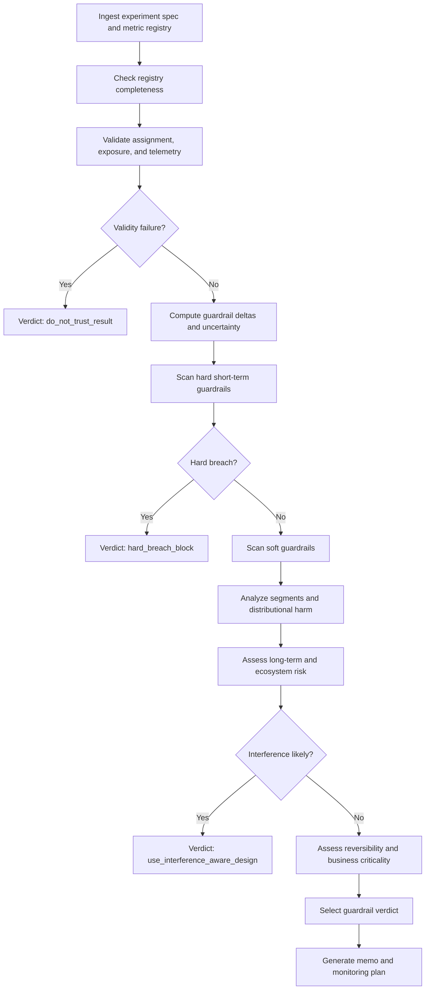

# Guardrail Metrics Playbook

This playbook defines how the agent should evaluate guardrail metrics in product experiments, rollout decisions, and automated experimentation reviews.

This file is designed for an evaluation-driven Agentic RAG system. The goal is not only to help the agent explain whether a product change is safe, but also to make the safety judgment auditable.

A good answer should make clear:

- which guardrails matter for the decision;
- whether each guardrail is a validity guardrail, hard product guardrail, or soft tradeoff guardrail;
- whether the experiment can be trusted before metric interpretation;
- whether the guardrail movement is statistically reliable and practically meaningful;
- whether the harm is concentrated in a key segment;
- whether short-term guardrails are enough or long-term holdouts are needed;
- whether the breach blocks launch, requires monitoring, or only triggers deeper review;
- what evidence is missing;
- and what the next responsible action should be.

The agent should not mechanically block launch because one secondary metric moved negative. It should also not ignore a guardrail because the primary metric improved.

The correct guardrail review is **validity-first, threshold-aware, segment-aware, and reversible when uncertainty is high**.

---

## Quick Retrieval Summary

Use this playbook when the user asks whether a metric decline, side effect, health metric, or safety signal should block a product launch or rollout.

This playbook is especially relevant when:

- the primary metric improves but a secondary metric worsens;
- the user asks whether a guardrail breach is serious;
- the user asks which guardrails should be used for an experiment;
- the experiment may have SRM, telemetry, logging, assignment, or exposure issues;
- latency, crashes, reports, refunds, churn, creator health, seller health, or advertiser ROI worsens;
- aggregate results look positive but one segment is harmed;
- short-term engagement conflicts with retention, monetization quality, trust, safety, reliability, or ecosystem health;
- the feature affects feeds, recommendations, ads, marketplaces, creators, sellers, or ranking systems;
- the user asks a vague product question such as “is this safe to ship?”;
- the evidence is observational, marketplace-interfered, or not cleanly randomized.

Default reasoning order:

1. Identify the decision and product context.
2. Validate experiment trustworthiness.
3. Classify each guardrail by type and severity.
4. Check registry completeness and thresholds.
5. Evaluate statistical reliability and practical magnitude.
6. Analyze segment and distributional harm.
7. Compare short-term and long-term guardrails.
8. Assess business criticality and reversibility.
9. Choose one guardrail verdict label.
10. State missing evidence and next steps.

---

## 1. Core Principle

A guardrail metric exists to prevent harmful local optimization.

The agent should reason from pre-specified thresholds, business context, and evidence quality, not from vibes.

A good guardrail review depends on:

- whether the experiment result is trustworthy;
- whether the guardrail was pre-registered;
- whether the guardrail has a clear denominator, window, owner, and threshold;
- whether the movement exceeds practical harm tolerance;
- whether the movement is statistically reliable;
- whether the harm affects a strategically important or protected segment;
- whether the breached guardrail is hard or soft;
- whether the harm is short-term, long-term, or ecosystem-level;
- whether the feature can be rolled back quickly;
- whether the primary benefit is durable enough to justify a soft tradeoff.

The agent should avoid two extremes:

- blocking every launch because a noisy secondary metric moved slightly negative;
- allowing harmful launches because the primary metric improved.

When evidence is incomplete, the agent should give a provisional guardrail verdict and recommend the smallest responsible next step.

---

## 2. Guardrail Verdict Labels

The agent should use exactly one primary guardrail verdict label.

Allowed labels:

- `guardrails_pass`
- `guardrails_pass_with_monitoring`
- `soft_breach_review`
- `hard_breach_block`
- `do_not_trust_result`
- `needs_long_term_holdout`
- `use_interference_aware_design`

The final launch recommendation may still come from `launch_decision.md`, but this playbook determines whether the guardrail evidence supports that decision.

---

## 3. Label Boundary Rules

Use exactly one primary guardrail verdict label.

Important boundaries:

- `guardrails_pass` means no material guardrail deterioration is detected and validity checks pass.
- `guardrails_pass_with_monitoring` means guardrails are within tolerance, but risk or uncertainty requires explicit monitoring and rollback thresholds.
- `soft_breach_review` means a guardrail moved negatively beyond a review threshold, but not enough to automatically block launch.
- `hard_breach_block` means the guardrail deterioration should block launch, halt ramp, or trigger rollback.
- `do_not_trust_result` means validity guardrails failed, so outcome metrics should not be interpreted as causal evidence.
- `needs_long_term_holdout` means short-term guardrails are insufficient because the likely harm is delayed, cumulative, or ecosystem-level.
- `use_interference_aware_design` means the experiment involves spillovers, marketplaces, auctions, social graphs, rankings, or supply-side effects that make naive user-level A/B guardrails insufficient.

Do not use `soft_breach_review` as a vague middle ground. Use it only when the agent can specify:

- breached metric;
- observed delta;
- soft threshold;
- affected population;
- whether the breach is reliable;
- what analysis or decision review is needed.

Do not use `guardrails_pass` if hard validity checks fail.

Do not use `guardrails_pass_with_monitoring` if a hard guardrail already exceeds its blocking threshold.

Do not treat a metric as a launch-blocking guardrail if it has no definition, denominator, threshold, or owner.

---

## 4. Detailed Guardrail Verdict Labels

### 4.1 `guardrails_pass`

Use `guardrails_pass` when the experiment is trustworthy and no guardrail shows material deterioration.

This is appropriate when:

- SRM, assignment, exposure, and logging checks pass;
- hard guardrails are stable;
- soft guardrails are within pre-registered tolerance;
- confidence intervals exclude material harm or the likely harm is below practical threshold;
- no important segment is harmed;
- long-term or ecosystem risks are low;
- the feature is reversible or already covered by standard monitoring.

Bad reasoning:

> CTR increased and latency is not statistically significant, so guardrails pass.

Better reasoning:

> Guardrails pass. SRM and telemetry checks pass; p95 latency increased by 1.2%, below the 5% soft threshold; crash rate and report rate are flat; D1 retention is within tolerance; no key segment shows reliable harm.

---

### 4.2 `guardrails_pass_with_monitoring`

Use `guardrails_pass_with_monitoring` when guardrails are currently acceptable, but the decision still requires explicit monitoring.

This is appropriate when:

- guardrail movement is slightly negative but within tolerance;
- confidence intervals include small but acceptable harm;
- the feature is reversible;
- long-term risk exists but is not severe;
- the change affects a high-scale surface but early evidence is clean;
- post-launch rollback thresholds are clear.

The agent should specify:

- metrics to monitor;
- monitoring window;
- alert owner if available;
- rollback threshold;
- segment cuts requiring extra attention.

Example:

> Guardrails pass with monitoring. The p95 latency increase is below the soft threshold, and crash rate is flat. Because this is a recommendation surface, monitor D7 retention, hides/reports, and creator exposure concentration for 14–28 days. Roll back if retention drops more than the registered tolerance or report rate exceeds the hard threshold.

---

### 4.3 `soft_breach_review`

Use `soft_breach_review` when a guardrail has deteriorated enough to require explicit tradeoff review, but the breach is not automatically launch-blocking.

This is appropriate when:

- a soft guardrail exceeds its review threshold;
- the harm is moderate or localized;
- the feature is reversible;
- the primary benefit may be meaningful enough to justify deeper review;
- segment impact is unclear;
- long-term evidence is incomplete;
- the breach may be caused by novelty, seasonality, or measurement noise.

The agent should not simply say “monitor it.” It should quantify the breach and specify the next analysis.

Bad:

> Complaints are a little up, so keep an eye on it.

Better:

> Soft breach review. Complaint rate increased by 8% relative, above the 5% soft threshold but below the 15% hard threshold. The agent should inspect complaint categories, affected segments, retention correlation, and reversibility before recommending broad launch.

---

### 4.4 `hard_breach_block`

Use `hard_breach_block` when a guardrail breach should block launch, halt ramp, or trigger rollback.

This applies when:

- safety, privacy, legal, policy, or compliance guardrails deteriorate materially;
- p95/p99 latency, crash rate, error rate, or availability exceeds hard thresholds;
- retention or churn worsens beyond maximum acceptable harm;
- refunds, chargebacks, cancellations, or advertiser ROI deteriorate materially;
- a protected, policy-sensitive, or strategically important segment is harmed;
- creator, seller, or marketplace health declines in a way that can damage ecosystem value;
- the feature creates user trust or brand harm that is difficult to reverse.

Do not offset a hard guardrail breach with a large primary metric lift unless a human owner explicitly accepts the risk and the harm is rapidly reversible.

Bad:

> Revenue increased 4%, but crash rate increased 20%, so launch with monitoring.

Better:

> Hard breach block. Crash rate exceeded the hard reliability threshold. The revenue lift should not override immediate customer-visible reliability harm. Halt rollout or roll back before further interpretation.

---

### 4.5 `do_not_trust_result`

Use `do_not_trust_result` when validity guardrails fail.

This applies when there are serious issues such as:

- sample ratio mismatch;
- randomization failure;
- assignment imbalance;
- unstable assignment;
- exposure mismatch;
- treatment/control contamination;
- missing or asymmetric telemetry;
- duplicated users or events;
- post-treatment filtering;
- bot or spam imbalance;
- denominator drift;
- metric instrumentation changes during the experiment;
- data pipeline changes during the experiment.

When this label is used, the agent should not interpret the measured primary lift or guardrail movement as causal evidence.

Bad:

> Conversion increased, but SRM exists, so launch carefully.

Better:

> Do not trust result. SRM means treatment and control may not be comparable. Diagnose assignment, exposure logging, eligibility filtering, and missing telemetry, then repair or rerun the experiment.

---

### 4.6 `needs_long_term_holdout`

Use `needs_long_term_holdout` when short-term guardrails are clean but the likely risk is delayed or cumulative.

This applies when the product change may affect:

- D7/D28 retention;
- user fatigue;
- content quality;
- creator or seller incentives;
- ad saturation;
- marketplace liquidity;
- advertiser trust;
- policy or safety prevalence;
- brand perception;
- cannibalization of existing surfaces;
- learning systems that adapt over time.

A short experiment can miss these risks. The agent should recommend a holdout, longer experiment, delayed-conversion readout, or post-launch cohort monitoring.

Example:

> Needs long-term holdout. Short-term engagement and reliability guardrails are stable, but the treatment changes feed ranking incentives. Hold out 5–10% of eligible users for 28 days and monitor D28 retention, hides/reports, creator exposure concentration, and content diversity before broad launch.

---

### 4.7 `use_interference_aware_design`

Use `use_interference_aware_design` when standard user-level A/B guardrails are likely biased by spillovers.

This applies when the experiment affects:

- social feeds;
- recommendation systems;
- ads auctions;
- creator distribution;
- marketplace matching;
- search ranking;
- inventory allocation;
- pricing or incentives;
- network effects.

Possible designs:

- cluster randomization;
- geo experiments;
- switchback experiments;
- marketplace-level holdouts;
- two-sided randomization;
- synthetic control;
- Difference-in-Differences;
- interrupted time series.

The agent should state that naive guardrails may understate harm if treated users affect untreated users or if demand-side gains come from supply-side losses.

---

## 5. Guardrail Classes

The agent must classify guardrails before evaluating severity.

Not all guardrails have the same decision weight.

---

### 5.1 Validity Guardrails

Validity guardrails determine whether the experiment can be interpreted.

Examples:

- SRM;
- assignment integrity;
- exposure logging consistency;
- trigger correctness;
- missing data rate;
- duplicate event rate;
- denominator stability;
- instrumentation consistency;
- bot or spam imbalance;
- contamination between variants.
- **Triggering & Dilution:** For features affecting a small subset of users, check if the guardrail is measured on the "triggered" population or the "all-up" population. If the treatment effect is heavily diluted by non-eligible users, the Agent should flag a "false pass" risk where harm is masked by noise.

If validity guardrails fail seriously, use `do_not_trust_result`.

Validity failures block interpretation before business tradeoff discussion.

---

### 5.2 Reliability and Performance Guardrails

Reliability guardrails protect customer-visible system quality.

Examples:

- p50/p95/p99 latency;
- crash-free sessions;
- HTTP 5xx rate;
- timeout rate;
- availability;
- SLO burn rate;
- queue backlog;
- task completion failure.

For reliability guardrails, the agent should prefer customer-visible metrics over internal service-only metrics.

A backend metric can look stable while the user experience degrades.

---

### 5.3 User Quality Guardrails

User quality guardrails protect experience quality and durable user value.

Examples:

- D1/D7/D28 retention;
- churn;
- session success rate;
- abandonment rate;
- complaint rate;
- support contact rate;
- hide/report/block rate;
- repeat query or reformulation rate;
- satisfaction survey score;
- successful task completion.

A treatment can increase clicks or time spent while lowering user quality.

---

### 5.4 Business Quality Guardrails

Business quality guardrails prevent low-quality revenue or funnel gaming.

Examples:

- refund rate;
- cancellation rate;
- chargeback rate;
- gross margin;
- checkout failure rate;
- advertiser ROI;
- conversion quality;
- monetized session quality;
- repeat purchase rate;
- customer lifetime value proxy.

Revenue alone is not enough if the treatment increases refunds, cancellations, or low-quality conversions.

---

### 5.5 Trust and Safety Guardrails

Trust and safety guardrails protect users, policy compliance, and platform integrity.

Examples:

- prevalence of violating content;
- violative view rate;
- scam loss rate;
- user reports per 10k views;
- false-positive enforcement rate;
- appeal reversal rate;
- harassment exposure;
- policy-critical incident rate;
- moderation queue overload.

For safety metrics, exposure-weighted denominators are usually better than raw takedown counts.

A metric should measure what users actually see or experience, not only what the system removes.

---

### 5.6 Fairness and Segment Guardrails

Fairness and segment guardrails protect important populations from concentrated harm.

Examples:

- max segment harm;
- segment-specific retention deltas;
- segment-specific complaint deltas;
- exposure-share gap;
- parity gap in successful outcomes;
- representation ratio;
- treatment effect by geography, platform, tenure, language, device, or user type.

A positive aggregate result can hide a segment-level regression.

Segment findings should be interpreted with caution when sample sizes are small or cuts were not pre-specified.

---

### 5.7 Marketplace, Creator, Seller, and Ecosystem Guardrails

Ecosystem guardrails protect multi-sided products from extracting value from one side while improving another.

Examples:

- seller churn;
- creator retention;
- creator exposure Gini;
- top-1% exposure share;
- catalog coverage;
- supply fill rate;
- active sellers or creators with sufficient exposure;
- buyer repeat rate after poor seller experience;
- advertiser ROI;
- content diversity;
- marketplace liquidity.

For multi-sided products, the agent should check both demand-side and supply-side outcomes.

---

## 6. Hard vs Soft and Short-Term vs Long-Term

The agent should classify every guardrail on two axes:

1. hard vs soft;
2. short-term vs long-term.

This creates four categories.

---

### 6.1 Hard + Short-Term

These guardrails usually block ramp immediately.

Examples:

- SRM;
- major telemetry asymmetry;
- severe latency regression;
- crash spike;
- availability failure;
- policy-critical safety spike;
- privacy or compliance issue.

Default action:

- halt ramp;
- rollback if already exposed;
- diagnose root cause;
- rerun or repair before interpreting outcomes.

---

### 6.2 Hard + Long-Term

These guardrails may require longer observation but should block broad launch if confirmed.

Examples:

- core retention cliff;
- protected or policy-sensitive segment harm;
- creator or seller churn;
- marketplace liquidity collapse;
- advertiser trust deterioration;
- long-term content quality degradation.

Default action:

- require holdout;
- extend experiment;
- restrict rollout;
- escalate owner review;
- block broad launch if harm is confirmed.

---

### 6.3 Soft + Short-Term

These guardrails trigger review but may not block launch alone.

Examples:

- moderate latency increase below SLO failure;
- small complaint uptick;
- mild abandonment increase;
- small support ticket increase;
- local funnel quality warning.

Default action:

- quantify magnitude;
- inspect segments;
- check reversibility;
- launch with monitoring only if within tolerance.

---

### 6.4 Soft + Long-Term

These guardrails usually require follow-up monitoring or holdouts.

Examples:

- mild D7 retention softness;
- moderate creator exposure concentration;
- monetization mix shift;
- content diversity decline;
- novelty effect risk;
- user fatigue risk.

Default action:

- holdout or staged ramp;
- delayed metric readout;
- post-launch cohort monitoring;
- explicit expansion criteria.

---

## 7. Guardrail Registry Requirements

A guardrail is not governable unless it has metadata.

Every guardrail should include:

| Field | Requirement |
|---|---|
| `metric_name` | Clear metric name used in scorecards and memos. |
| `classification` | Validity, reliability, user quality, business quality, safety, fairness, ecosystem. |
| `owner` | Team or person accountable for threshold and action. |
| `unit_of_analysis` | User, session, request, creator, seller, advertiser, geo, cluster, item, impression. |
| `formula` | Numerator, denominator, filters, and exclusions. |
| `denominator` | Stable denominator used for comparison. |
| `window` | Short-term, D1, D7, D28, weekly, monthly, or holdout window. |
| `direction_of_harm` | Whether increase or decrease is bad. |
| `soft_threshold` | Review threshold. |
| `hard_threshold` | Blocking or rollback threshold. |
| `confidence_rule` | p-value, CI, posterior probability, non-inferiority rule, or practical-only rule. |
| `segment_policy` | Required segment cuts and minimum sample size. |
| `winsorization_policy` | Outlier handling for revenue, latency, spend, or heavy-tailed metrics. |
| `action_on_breach` | Monitor, review, hold, rollback, block, rerun, escalate. |
| `reversibility_owner` | Person or system responsible for kill switch or rollback. |

If the registry is incomplete for a hard guardrail, the agent should not claim the launch is safe.

---

## 8. Threshold and Non-Inferiority Logic

A guardrail does not need to improve. It needs to not deteriorate beyond the maximum acceptable harm.

For guardrails, the core question is not:

> Did this metric move at all?

The better question is:

> Did this metric get worse by more than the pre-registered harm tolerance?

Use non-inferiority logic when appropriate.

Examples:

- p95 latency must not increase by more than 5% for soft review or 10% for hard block;
- crash rate must not increase beyond reliability threshold;
- D7 retention must not decline beyond the allowed percentage-point tolerance;
- refund rate must not increase beyond business-quality tolerance;
- report rate or safety prevalence must not exceed policy-critical thresholds;
- advertiser ROI must not fall beyond agreed tolerance;
- creator concentration must not exceed ecosystem threshold.

The agent should evaluate both:

- absolute change, such as `-0.3 percentage points`;
- relative change, such as `-2.1% relative`.

For low-base-rate harms, relative changes can look large while absolute impact is small. For high-scale safety or reliability metrics, small absolute changes can still be important.

#### 8.1 Variance-Aware Baselines

The Agent should compare observed deltas against the metric's **historical daily variance**. If a 2% decline in a guardrail is within the normal 7-day rolling noise (standard deviation), the verdict should lean towards `guardrails_pass_with_monitoring`. If the decline is small but historically unprecedented (e.g., a 5-sigma event), it should be elevated to `soft_breach_review` regardless of the absolute threshold.

---

## 9. Suggested Default Thresholds

These thresholds are starting points, not universal standards. Product teams should tune them by surface risk, metric variance, historical baseline, regulation, and reversibility.

| Guardrail class | Suggested soft threshold | Suggested hard threshold | Cadence | Default action |
|---|---:|---:|---|---|
| Experimental validity | Any unexpected imbalance, missingness, or logging anomaly | SRM at registry threshold; proven assignment or telemetry asymmetry | Every scorecard refresh | `do_not_trust_result`; diagnose and rerun |
| Latency / reliability | p95/p99 latency +5% relative; crash/error +5% relative | p95/p99 +10% relative; SLO violation; paging-level burn | 5–15 min at ramp, then hourly | Hold or rollback |
| Retention | D1/D7 decline >0.3 pp on core cohorts or >0.5% relative on non-core surfaces | D1/D7 decline >1–2% relative or D28 confirms core decline | Daily, plus D7/D28 | Holdout, redesign, or block |
| Revenue quality | Refund/cancel/chargeback +5–10% relative | +15–20% relative or net-good revenue turns negative | Daily | Hold or block depending reversibility |
| Complaints / safety | Reports, prevalence, or VVR +5–10% relative | +10–20% relative or policy-critical deterioration | Hourly to daily | Escalate; hard breach blocks |
| Fairness / segment harm | Critical segment harm exceeds max(0.5 pp, 20% of overall gain) | Material harm to protected/policy-sensitive segment | Daily for registered segments | Retarget, redesign, or block |
| Creator / seller ecosystem | Catalog coverage -5%, top-1% exposure +5%, seller/creator health -5% | Catalog coverage -10%, top-1% exposure +10%, churn/supply-health decline | Weekly plus 28-day review | Holdout, ranking redesign, ecosystem review |

When the user provides product-specific thresholds, use those instead of defaults.

---

## 10. Monitoring Cadence by Stage

| Stage | Required checks | Suggested cadence | Agent action |
|---|---|---|---|
| Pre-launch | Registry completeness, metric definitions, AA sanity checks, segment definitions, kill switch ownership | Once before exposure | Refuse confident safety judgment if hard guardrail metadata is missing |
| Initial ramp | SRM, exposures, join rate, missingness, latency, errors, crashes, severe abuse signals | Every 5–15 minutes | Auto-stop or recommend rollback if hard short-term guardrails trip |
| Early scale-up | Primary metric, hard guardrails, top segments, triggered vs diluted views | Every 30–60 minutes | Continue, hold, or rollback based on breach severity |
| Steady experiment | Full scorecard, segment cuts, practical effect, uncertainty, multiple testing | Daily | Produce decision memo, not just dashboard summary |
| Post-decision validation | D7/D28 retention, delayed conversion/refunds, creator/seller health, holdout results | Daily then weekly | Confirm, reverse, or revise launch decision |

---

## 11. Required Reasoning Order

For every guardrail review, the agent should reason in this order.

---

### Step 1: Clarify the Decision

Identify what the user is asking.

Examples:

- Does this guardrail breach block launch?
- Are these side effects acceptable?
- Which guardrails should we monitor?
- Can we ramp despite this metric decline?
- Should we rerun because of SRM or logging issues?
- Should we use a holdout because long-term harm is unclear?

If the user asks “is this safe?”, translate the question into a guardrail decision.

---

### Step 2: Identify Product Context

The agent should infer or ask:

- What is the product surface?
- What treatment changed?
- Who is affected?
- What is the primary product goal?
- Is this UI, onboarding, ranking, ads, marketplace, policy, safety, or infrastructure?
- Is the feature reversible?
- Is the guardrail tied to user harm, business harm, reliability, safety, fairness, or ecosystem health?

A small UI copy change and a feed-ranking model change require different guardrail standards.

---

### Step 3: Validate Experiment Trustworthiness

Before interpreting any guardrail movement, check whether the experiment can be trusted.

Important checks:

- SRM;
- correct randomization unit;
- stable assignment;
- treatment/control contamination;
- exposure consistency;
- logging completeness;
- denominator stability;
- delayed data;
- duplicated users or events;
- post-treatment filtering;
- bot or spam imbalance;
- pipeline or instrumentation changes.

If validity fails seriously, use `do_not_trust_result`.

---

### Step 4: Classify Guardrails

For each relevant metric, classify:

- validity guardrail;
- hard product guardrail;
- soft product guardrail;
- diagnostic metric;
- long-term proxy;
- ecosystem metric.

The agent should not treat all secondary metrics as guardrails.

A metric is a guardrail only if it has an acceptable-harm threshold and an action on breach.

---

### Step 5: Check Registry Completeness

For each guardrail, verify:

- formula;
- denominator;
- owner;
- window;
- direction of harm;
- soft threshold;
- hard threshold;
- segment policy;
- confidence or non-inferiority rule;
- action on breach.

If a hard guardrail lacks this metadata, the agent should flag missing governance before recommending a confident launch.

---

### Step 6: Evaluate Statistical Reliability

The agent should consider:

- confidence interval;
- p-value or posterior probability;
- one-sided vs two-sided test;
- multiple testing;
- sample size;
- segment sample size;
- variance and historical baseline;
- peeking or early stopping;
- stability over time.

A noisy soft guardrail movement may justify monitoring. A noisy but severe safety or reliability signal may still justify stopping ramp.

---

### Step 7: Evaluate Practical Magnitude

The agent should ask:

- Is the absolute change large enough to matter?
- Is the relative change large enough to matter?
- Does the movement exceed the pre-registered threshold?
- Is the lower or upper bound of the CI outside harm tolerance?
- Is the base rate low enough that a small absolute change is still meaningful at scale?
- Does the harm affect a metric tied to durable product value?

Statistical significance alone should not determine guardrail severity.

---

### Step 8: Analyze Segment Harm

Averages can hide harm.

Check whether guardrail deterioration is concentrated among:

- new vs existing users;
- high-value vs low-value users;
- power users vs casual users;
- paid vs free users;
- creators vs consumers;
- buyers vs sellers;
- advertisers vs users;
- geographies;
- languages;
- platforms;
- acquisition channels;
- content categories;
- risk or safety groups.

A segment breach should be interpreted with sample size, pre-specification, and business criticality in mind.

---

### Step 9: Compare Short-Term and Long-Term Guardrails

Short experiments may miss delayed harm.

The agent should check whether the product change could affect:

- D7 or D28 retention;
- user fatigue;
- delayed refunds or cancellations;
- long-term advertiser ROI;
- creator/seller churn;
- content quality;
- policy prevalence;
- marketplace liquidity;
- cannibalization of other surfaces.

If long-term risk is material, prefer `needs_long_term_holdout` over a clean `guardrails_pass`.

---

### Step 10: Assess Reversibility and Business Criticality

The same guardrail movement can imply different decisions depending on reversibility.

The agent should check:

- Is there a feature flag?
- Is there a kill switch?
- Is data migration reversible?
- Does rollback require model retraining?
- Is user trust damage reversible?
- Is the harm safety, legal, policy, or compliance-related?
- Is the affected population strategically important?

High criticality and low reversibility lower the acceptable harm tolerance.

---

### Step 11: Select Verdict and State Next Action

The final answer should include:

- guardrail verdict label;
- breached metrics;
- thresholds;
- statistical reliability;
- practical magnitude;
- affected segments;
- reversibility;
- missing evidence;
- next action.

The agent should avoid overconfident safety claims when key evidence is missing.

---

## 12. Launch-Blocking Rubric

A guardrail breach should not be judged by p-value alone.

Use five dimensions:

| Dimension | What to test | Default interpretation |
|---|---|---|
| Validity | SRM, assignment, exposure, logging, denominator stability, trigger correctness | Any serious validity failure blocks interpretation. Use `do_not_trust_result`. |
| Statistical reliability | CI, p-value, power, multiplicity, segment sample size, stability over time | Weak evidence may require more data unless potential harm is critical. |
| Practical magnitude | Absolute delta, relative delta, SLO burn, threshold exceedance, scale impact | Medium/large harm should drive action even if the primary metric improves. |
| Business criticality | Safety, privacy, legality, retention, revenue quality, partner health, fairness | Higher criticality lowers tolerance. Some metrics are non-tradeable. |
| Reversibility | Kill switch, rollback path, migration state, model retrain latency, trust damage | Reversible soft harm may allow controlled ramp; irreversible harm should block faster. |

Apply lexicographic priority:

1. Validity.
2. Safety, legal, policy, and severe reliability guardrails.
3. Statistical reliability.
4. Practical magnitude.
5. Business tradeoff and reversibility.

Do not let a large primary lift “outvote” a broken experiment or a hard safety/reliability breach.

---

## 13. Decision Matrix

Use this matrix to convert evidence into a guardrail verdict.

| Evidence Pattern | Recommended Verdict |
|---|---|
| Validity checks pass, hard guardrails stable, soft guardrails within tolerance, no segment harm | `guardrails_pass` |
| Guardrails are within tolerance but uncertainty, delayed effects, or high-risk surface remains | `guardrails_pass_with_monitoring` |
| One or more soft guardrails exceed review threshold but not hard threshold | `soft_breach_review` |
| Hard reliability, safety, privacy, legal, policy, or core retention guardrail exceeds threshold | `hard_breach_block` |
| SRM, assignment, logging, exposure, or telemetry failure exists | `do_not_trust_result` |
| Short-term guardrails pass but D7/D28, ecosystem, fatigue, or delayed business quality risk is material | `needs_long_term_holdout` |
| Marketplace, ranking, auction, social graph, or supply-side spillover makes user-level A/B guardrails biased | `use_interference_aware_design` |
| Primary metric up, retention down beyond tolerance | Usually `hard_breach_block` or `soft_breach_review`, depending severity |
| CTR or clicks up, conversion or successful sessions down | Usually `soft_breach_review` or `hard_breach_block` |
| Revenue up, complaints or refunds up materially | `soft_breach_review` or `hard_breach_block` |
| Aggregate positive, key segment harmed | `soft_breach_review` or `hard_breach_block` |
| Consumer metrics up, creator/seller health down | `needs_long_term_holdout` or `use_interference_aware_design` |
| Guardrail movement is negative but tiny, noisy, and below threshold | `guardrails_pass_with_monitoring` |

---

## 14. Common Tradeoff Patterns

### 14.1 Primary Up / Guardrails Stable

Likely interpretation:

- clean positive result;
- no material harm detected;
- decision can proceed if launch criteria are otherwise met.

Recommended action:

- `guardrails_pass`;
- standard monitoring;
- use launch decision playbook for final ship decision.

Memo language:

> Primary metric improved and no validated hard or soft guardrail regression exceeds tolerance. Guardrails pass with standard post-launch monitoring.

---

### 14.2 Primary Up / Retention Down

Likely interpretation:

- local optimization may be harming durable value;
- engagement, revenue, clicks, or opens may be purchased through fatigue or lower quality.

Recommended action:

- `soft_breach_review` if decline is small and within uncertainty;
- `hard_breach_block` if retention exceeds harm tolerance;
- `needs_long_term_holdout` if D7/D28 evidence is not mature.

Memo language:

> Primary metric improved, but retention declined beyond the registered tolerance. Because retention is a long-term health guardrail, broad launch should be held until the decline is explained or reversed.

---

### 14.3 CTR Up / Conversion Down

Likely interpretation:

- click metric may be gamed;
- treatment may increase curiosity, misclicks, or low-quality traffic;
- lower-funnel quality worsened.

Recommended action:

- usually `soft_breach_review` or `hard_breach_block`;
- inspect successful sessions, conversion quality, revenue quality, and user complaints.

Memo language:

> Upper-funnel engagement increased, but lower-funnel conversion declined. Treat this as a potential false-positive local win rather than a clean product improvement.

---

### 14.4 Revenue Up / Complaints Up

Likely interpretation:

- monetization gain may be low-quality, coercive, confusing, or trust-damaging.

Recommended action:

- `soft_breach_review` if complaints are moderate and reversible;
- `hard_breach_block` if complaint or safety threshold is exceeded;
- inspect complaint categories and affected cohorts.

Memo language:

> Revenue improved, but complaint rate increased materially. The agent should pause broad launch pending complaint deep-dive, user-quality review, and rollback threshold definition.

---

### 14.5 Latency Up / Reliability Down

Likely interpretation:

- operational regression;
- customer-visible harm may be immediate;
- the breach often dominates business metric gains.

Recommended action:

- `hard_breach_block` if threshold is exceeded;
- rollback or halt ramp.

Memo language:

> Customer-visible performance or reliability regressed beyond threshold. Because this is a hard operational guardrail, recommend rollback or halted ramp.

---

### 14.6 Aggregate Win / Segment Harm

Likely interpretation:

- average effect masks concentrated harm;
- broad launch may be inappropriate even if total effect is positive.

Recommended action:

- `soft_breach_review` for noisy or non-critical segment harm;
- `hard_breach_block` for protected, policy-sensitive, or strategic segment harm;
- consider targeted rollout or redesign.

Memo language:

> Aggregate result is positive, but segment X experiences a reliable decline exceeding tolerance. Recommend blocking broad launch until targeting or product behavior is corrected.

---

### 14.7 Consumer Win / Creator or Seller Health Down

Likely interpretation:

- treatment may extract value from supply side;
- demand-side metrics may be biased by marketplace interference.

Recommended action:

- `needs_long_term_holdout`;
- `use_interference_aware_design` if spillovers are likely;
- require ecosystem review.

Memo language:

> Consumer-facing metrics improved, but creator/seller concentration and supply health worsened. Recommend holdout validation and ecosystem review before broad launch.

---

### 14.8 SRM Failure

Likely interpretation:

- experiment is likely invalid;
- metric movements are not trustworthy causal evidence.

Recommended action:

- `do_not_trust_result`;
- diagnose assignment, filtering, exposure, logging, and missingness;
- repair or rerun.

Memo language:

> Observed SRM invalidates effect interpretation. Do not use primary or guardrail metric movements as launch evidence until root cause is diagnosed.

### 14.9 Causal Pairing & Intent Inference
When interpreting breaches, the Agent must look for "Causal Pairs" to infer user harm vs. system behavior:
* **The "Frustration" Pair:** Clicks up + Task Completion down = Likely UI confusion or dark patterns.
* **The "Fatigue" Pair:** Short-term Engagement up + D7 Retention down = Likely novelty effect or notification burnout.
* **The "Quality" Pair:** Revenue up + Refund/Complaint rate up = Likely low-quality monetization or coercive design.

If a "Frustration" or "Quality" pair is detected, the Agent should default to `hard_breach_block` even if the Primary Metric is strongly positive.

---

## 15. Segment Analysis Framework

Guardrails should be evaluated both overall and by pre-registered segments.

Required segment cuts depend on the product, but common cuts include:

- new vs existing users;
- high-value vs low-value users;
- power users vs casual users;
- paid vs free users;
- creators vs consumers;
- buyers vs sellers;
- advertisers vs users;
- geography;
- language;
- platform;
- device class;
- acquisition channel;
- tenure;
- content category;
- risk group.

The agent should distinguish:

- reliable segment harm;
- noisy segment movement;
- multiple-testing artifact;
- strategically important harm;
- protected or policy-sensitive harm.

A segment breach should not be ignored just because the aggregate is positive.

The agent should also avoid overreacting to a tiny, underpowered segment cut.

---

## 16. Long-Term and Ecosystem Risk Framework

Some guardrail failures appear only after the initial experiment window.

Watch for:

- novelty effects;
- user fatigue;
- delayed churn;
- refund or cancellation lag;
- advertiser ROI lag;
- creator or seller incentive shifts;
- content quality decline;
- exposure concentration;
- ad saturation;
- cannibalization of other surfaces;
- trust and safety externalities;
- regulatory or policy risk.

When long-term risk is material, the agent should recommend:

- longer experiment duration;
- long-term holdout group;
- delayed-conversion window;
- D7/D28 cohort readout;
- weekly ecosystem health review;
- post-launch rollback thresholds;
- institutional memory update.

Do not call guardrails “clean” if only short-term technical metrics have been checked for a long-term ranking or marketplace change.

---

## 17. Interference and Marketplace Effects

Some guardrails are biased when one unit’s treatment affects another unit’s outcome.

Watch for interference in:

- social graphs;
- feeds;
- recommendation systems;
- ads auctions;
- marketplaces;
- creator ecosystems;
- inventory allocation;
- ranking systems;
- pricing and incentives.

Examples:

- a feed ranking change may shift exposure from small creators to large creators;
- an ads change may increase short-term revenue while reducing advertiser ROI;
- a marketplace change may help buyers while increasing seller churn;
- a recommendation model may improve treated-user engagement but reduce content diversity;
- a search ranking change may cannibalize traffic from other surfaces.

If interference is likely, the agent may recommend:

- cluster randomization;
- geo experiments;
- switchback experiments;
- two-sided randomization;
- marketplace-level holdouts;
- synthetic control;
- Difference-in-Differences.

Use `use_interference_aware_design` when naive user-level guardrails are not enough.

---

## 18. Handling Missing or Ambiguous Information

Users often provide only partial scorecard evidence.

If key information is missing, the agent should still provide a provisional guardrail verdict, but must label it as conditional.

Do not ask a long list of clarifying questions before giving value. Instead:

1. restate the likely guardrail question;
2. give a provisional verdict if possible;
3. list the 3–5 most decision-critical missing inputs;
4. explain how the verdict would change under different outcomes.

**Decision-Critical Missing Inputs include:**
- **Power & MDE:** Was the experiment powered enough to detect the pre-registered harm threshold? A "flat" guardrail on an underpowered test is not a "pass"; it is "inconclusive" due to insufficient sensitivity.
- **Thresholds & Registries:** Are the soft/hard thresholds defined for the observed movement?
- **Validity Checks:** Is the result based on a verified sample ratio (SRM-free) and stable assignment?

Example:

> Provisional verdict: `soft_breach_review`. The primary metric improved, but complaint rate increased and we do not yet know whether the increase exceeds the registered threshold or is concentrated in a key segment. If complaints exceed the hard threshold or correlate with retention decline, block launch. If the increase is below tolerance and reversible, launch with monitoring may be reasonable.

The agent should avoid pretending guardrails are clean when thresholds, windows, or validity checks are missing.

---

## 19. Agent Execution Pipeline



This pipeline is intentionally validity-first. Outcome interpretation happens only after assignment and telemetry checks pass.

---

## 20. Ordered Algorithmic Checks

1. **Registry completeness check**
   - Fail fast if a hard guardrail lacks formula, denominator, threshold, owner, or action.

2. **Validity check**
   - SRM, assignment integrity, exposure consistency, trigger correctness, missingness, duplicates, denominator drift.

3. **Expected-move check**
   - Verify that diagnostic metrics move in directions implied by the treatment. Unexpected movement may indicate logging or mechanism issues.

4. **Guardrail delta computation**
   - Absolute delta, relative delta, CI, p-value/posterior, minimum practical effect, threshold comparison.

5. **Hard-guardrail scan**
   - Validity, reliability, safety, privacy, legality, policy, core retention.

6. **Soft-guardrail scan**
   - Complaints, abandonment, mild latency, quality, revenue mix, moderate ecosystem concentration.

7. **Segment and distributional scan**
   - Pre-registered segments, max segment harm, sample size, multiple testing caution.

8. **Short-term vs long-term reconciliation**
   - If short-term proxy is positive but long-term health is uncertain, recommend holdout rather than clean pass.

9. **Interference check**
   - Determine whether user-level A/B readout is biased by network, marketplace, auction, ranking, or supply-side spillovers.

10. **Verdict selection**
    - Use exactly one guardrail verdict label.

11. **Memo generation**
    - Include facts, thresholds, and next actions rather than adjectives.

12. **Institutional memory update**
    - Log decision, rationale, thresholds, and observed tradeoffs for later retrieval.

---

## 21. Response Template for the Agent

When answering a guardrail metric question, use this structure.

```text
Guardrail verdict: [guardrails_pass / guardrails_pass_with_monitoring / soft_breach_review / hard_breach_block / do_not_trust_result / needs_long_term_holdout / use_interference_aware_design]

Decision problem:
[Restate what safety or guardrail decision is being made.]

Product context:
[Surface, treatment, affected users, risk tier if known.]

Guardrail classification:
- Validity guardrails:
- Hard product guardrails:
- Soft product guardrails:
- Long-term / ecosystem guardrails:
- Diagnostic metrics not treated as guardrails:

Evidence assessment:
1. Validity checks: [Including SRM and Exposure/Triggering integrity]
2. Metric deltas vs. Thresholds: [Observed vs. Soft/Hard limits]
3. Statistical vs. Historical Significance: [Is the move outside normal historical variance?]
4. Practical magnitude & Dilution: [Was the effect diluted by a large denominator?]
5. Causal Pairing: [Does the movement in X explain the decline in Y?]
6. Segment effects:
7. Long-term / ecosystem risk:
8. Reversibility:

Recommendation:
[Clear guardrail recommendation and how it should affect launch decision.]

Missing evidence:
- [Evidence 1]
- [Evidence 2]
- [Evidence 3]

Next steps:
- [Analysis step]
- [Monitoring or holdout step]
- [Rollback / block / expansion threshold]
```

---

## 22. Memo Template

```text
Experiment: [name / id]
Guardrail verdict: [label]
Primary outcome: [metric, delta, CI, practical magnitude]
Guardrail summary: [hard breaches, soft breaches, segment harms]
Validity summary: [SRM / assignment / exposure / telemetry / trigger / population checks]
Threshold comparison: [observed movement vs soft and hard thresholds]
Tradeoff assessment: [why primary gain does or does not offset guardrail movement]
Segment assessment: [key segment cuts and max harm]
Long-term risk: [retention / ecosystem / marketplace / safety / delayed business quality]
Reversibility: [kill switch / rollback / migration constraints]
Recommended action: [pass, monitor, review, holdout, rollback, rerun, redesign]
Monitoring plan: [window, cadence, owner, alert threshold]
Open risks: [what remains uncertain]
```

The memo should be executable. If the agent cannot point to a next action, it has not finished the review.

---

## 23. Worked Examples

### 23.1 Primary Up / Guardrails Stable

User question:

> Search successful-session rate increased. D1 retention, p95 latency, and error rate look flat. Are guardrails okay?

Good answer pattern:

> Guardrail verdict: `guardrails_pass`. Validity checks pass. Successful-session rate improved by a meaningful amount. D1 retention is within tolerance, p95 latency increased only slightly below the soft threshold, and error rate is flat. No key segment shows reliable harm. Proceed to launch decision review with standard monitoring.

---

### 23.2 Primary Up / Retention Down

User question:

> Notification opens increased 6%, but D7 retention dropped 0.8 pp and mute rate increased. Is this okay?

Good answer pattern:

> Guardrail verdict: `hard_breach_block` if the D7 decline exceeds the registered threshold; otherwise `soft_breach_review`. This looks like local engagement purchased through user fatigue. Inspect new vs existing users, notification volume, complaint categories, and D28 retention before launch.

Bad answer pattern:

> Opens increased, so ship it.

This ignores retention as a durable user-value guardrail.

---

### 23.3 CTR Up / Conversion Down

User question:

> Card CTR increased 11%, but checkout conversion dropped 8%. Should we treat this as a guardrail issue?

Good answer pattern:

> Guardrail verdict: `hard_breach_block` or `soft_breach_review` depending threshold. CTR is likely diagnostic. A lower-funnel conversion decline suggests the design may create low-quality clicks or mislead users. Do not treat CTR lift as a clean win until conversion quality is repaired.

---

### 23.4 Revenue Up / Complaints Up

User question:

> Revenue per user increased, but complaint rate increased 9%. What should the agent do?

Good answer pattern:

> Guardrail verdict: `soft_breach_review`. Complaint rate exceeded the soft threshold but may be below hard block. Inspect complaint categories, affected cohorts, support tickets, retention correlation, and whether the revenue lift remains positive after refunds/cancellations. Launch only with explicit monitoring if the harm is reversible and below hard threshold.

---

### 23.5 Reliability Breach

User question:

> The experiment improves conversion, but p99 latency is up 14% and timeout rate increased.

Good answer pattern:

> Guardrail verdict: `hard_breach_block`. Customer-visible reliability exceeded the hard threshold. Halt ramp or roll back before using conversion lift as launch evidence.

---

### 23.6 SRM Detected

User question:

> Treatment increased conversion by 3%, but the sample ratio is off. Can we launch if guardrails are stable?

Good answer pattern:

> Guardrail verdict: `do_not_trust_result`. SRM is a validity guardrail failure. Do not interpret conversion or guardrail stability as causal evidence until assignment, eligibility, exposure logging, missingness, and filtering are diagnosed and the test is repaired or rerun.

---

### 23.7 Aggregate Positive / Segment Harm

User question:

> Overall retention is flat, but Android new users declined 1.1 pp while iOS improved. Is this a blocker?

Good answer pattern:

> Guardrail verdict: `soft_breach_review` or `hard_breach_block` depending segment importance and threshold. Aggregate retention hides platform-specific harm. Check sample size, pre-specification, Android crash/latency, onboarding completion, and whether rollout can be platform-targeted.

---

### 23.8 Marketplace Spillover

User question:

> Buyer conversion increased, but seller-side supply fill rate and small-seller exposure dropped.

Good answer pattern:

> Guardrail verdict: `use_interference_aware_design`. Demand-side gains may be coming from supply-side harm. Use marketplace-level holdouts, cluster randomization, or switchback/geo design, and monitor seller churn, catalog coverage, exposure concentration, and repeat buyer quality.

---

## 24. Guardrail Design Checklist

When proposing guardrails for a new experiment, include:

- primary decision metric;
- success metrics;
- diagnostic metrics;
- validity guardrails;
- hard product guardrails;
- soft product guardrails;
- long-term guardrails;
- segment cuts;
- denominator definitions;
- short-term and long-term windows;
- soft and hard thresholds;
- monitoring cadence;
- rollback or halt criteria;
- owner for each guardrail;
- reversibility plan.

A good guardrail set is small enough to act on but broad enough to catch meaningful harm.

---

## 25. Evaluation Criteria for Agent Answers

This playbook should support both answer generation and answer evaluation.

A high-quality answer should:

- choose one guardrail verdict label;
- classify guardrails before interpreting movement;
- check validity before outcome interpretation;
- compare observed movement to thresholds;
- distinguish hard and soft guardrails;
- distinguish statistical reliability from practical harm;
- analyze segment heterogeneity;
- consider long-term and ecosystem risk;
- assess reversibility;
- state missing evidence;
- provide concrete next steps;
- avoid overclaiming when thresholds or validity checks are missing.

Penalize an answer if it:

- ignores SRM, logging, assignment, or exposure issues;
- treats all secondary metrics as equal;
- treats CTR, clicks, impressions, or short-term time spent as sufficient evidence of product value;
- ignores a hard guardrail breach because the primary metric improved;
- blocks launch based only on a noisy, tiny, unregistered soft metric;
- ignores harmed strategic segments;
- fails to compare against soft and hard thresholds;
- gives generic advice without a guardrail verdict;
- recommends monitoring without specifying metrics, windows, thresholds, and actions;
- says guardrails pass when long-term or marketplace risks are unmeasured.

A strong answer should feel like a senior data scientist writing a concise guardrail review, not like a generic explanation of A/B testing.

---

## 26. Common Failure Modes

The agent should avoid these failure modes:

1. **Validity-last reasoning**

   Interpreting primary and guardrail lifts before checking SRM, assignment, exposure, and logging.

2. **Primary-metric dominance**

   Letting a large success metric lift override hard safety, reliability, or trust guardrail harm.

3. **Metric noise overreaction**

   Blocking launch because a small, underpowered, unregistered metric moved slightly negative.

4. **Threshold-free judgment**

   Calling a guardrail “bad” or “fine” without comparing it to a pre-registered tolerance.

5. **Averages-only reasoning**

   Ignoring segment-level harm hidden by a positive aggregate effect.

6. **Short-term bias**

   Declaring guardrails clean before D7/D28, delayed conversion, refunds, or ecosystem metrics mature.

7. **Dashboard dumping**

   Listing metrics without classifying which ones are validity checks, hard guardrails, soft guardrails, diagnostics, or long-term proxies.

8. **Monitoring without action**

   Saying “monitor it” without specifying cadence, owner, threshold, and rollback action.

9. **Ignoring interference**

   Using naive user-level A/B guardrails for marketplaces, auctions, feeds, or ranking systems with spillovers.

10. **No next step**

   Ending with a vague concern rather than a concrete decision, holdout, rerun, rollback, or redesign action.

---

## 27. Relationship to `launch_decision.md`

This playbook is a companion to `launch_decision.md`.

Use `guardrail_metrics.md` to answer:

- Are the guardrails valid?
- Did any guardrail breach?
- Is the breach soft or hard?
- Does the breach require review, holdout, rollback, or rerun?
- What monitoring plan is required?

Use `launch_decision.md` to answer:

- Should the product launch?
- Should it launch with monitoring?
- Should it partially roll out?
- Should the team investigate further?
- Should the result be ignored as invalid?
- Should the team use a quasi-experimental design?

Guardrail verdicts should feed into launch decisions:

| Guardrail verdict | Likely launch-decision implication |
|---|---|
| `guardrails_pass` | `launch` or `launch_with_monitoring`, depending primary evidence and risk tier |
| `guardrails_pass_with_monitoring` | `launch_with_monitoring` or `partial_rollout` |
| `soft_breach_review` | `investigate_further`, `partial_rollout`, or `launch_with_monitoring` with strict thresholds |
| `hard_breach_block` | usually `do_not_launch` or rollback |
| `do_not_trust_result` | `do_not_trust_result` |
| `needs_long_term_holdout` | `investigate_further` or `partial_rollout` with holdout |
| `use_interference_aware_design` | `use_did_or_quasi_experiment` or an interference-aware randomized design |

The guardrail review should happen before the final launch recommendation.
